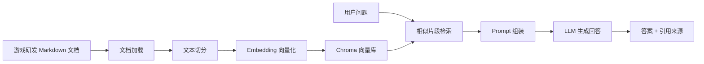

# Demo 说明：游戏研发文档问答助手

## 1. 业务痛点

游戏研发过程中会产生大量策划文档、活动规则、道具规则、客服 FAQ 和版本公告。这些资料分散在不同位置，新人或跨部门成员查找信息成本较高。传统方式依赖人工搜索和询问负责人，效率较低，也容易因为资料遗漏导致沟通成本上升。

## 2. Demo 目标

本 Demo 通过 RAG 技术构建一个游戏研发文档问答助手，验证 AI 在研发知识检索场景中的可行性。用户输入自然语言问题后，系统从知识库中检索相关文档片段，再基于这些片段生成回答，并展示引用来源。

## 3. 技术架构

## 4. 技术组件

| 组件 | 作用 |
| --- | --- |
| Streamlit | 提供简单 Web 交互页面 |
| LangChain | 组织文档加载、切分、检索和模型调用流程 |
| Chroma | 存储和检索文档向量 |
| OpenAI-compatible LLM | 根据检索片段生成回答 |
| Markdown 文档 | 模拟游戏项目资料 |

## 5. 可验证结论

该 Demo 可以验证报告中的几个结论：

- RAG 可以降低游戏研发文档查询成本。
- 引用来源可以降低模型幻觉风险。
- 文档问答助手适合作为部门 AI 落地的第一批低风险 MVP。
- 后续可以扩展到客服知识库、策划设定问答、测试文档问答等场景。

## 6. MVP 边界

当前 Demo 只验证最小链路，不包含企业权限、真实文档同步、多人协作、复杂评估和模型成本控制。正式落地时需要补充权限控制、数据脱敏、文档更新机制、回答质量评估和用户反馈闭环。

