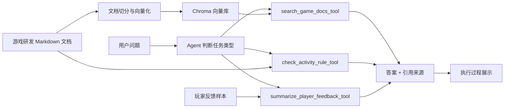

# Demo 说明：游戏研发多场景 AI Agent

## 1. 业务痛点

游戏研发过程中会产生大量策划文档、活动规则、道具规则、客服 FAQ、版本公告和玩家反馈。这些资料分散在不同位置，新人或跨部门成员查找信息成本较高；活动规则检查依赖人工经验；运营反馈整理也需要花费较多时间。传统方式依赖人工搜索、人工检查和人工汇总，效率较低，也容易因为资料遗漏导致沟通成本上升。

## 2. Demo 目标

本 Demo 通过 LangChain Tool 与 RAG 技术构建一个游戏研发多场景 AI Agent，验证 AI 在研发知识检索、策划规则检查和运营反馈分析中的可行性。用户输入自然语言问题后，Agent 判断任务类型，选择对应工具执行，并展示执行过程、工具结果和引用来源。

## 3. 技术架构

## 4. 技术组件

| 组件 | 作用 |
| --- | --- |
| Streamlit | 提供简单 Web 交互页面 |
| LangChain | 组织文档加载、切分、工具封装、检索和模型调用流程 |
| LangChain Tool | 将文档检索、规则检查、反馈摘要封装为 Agent 可调用工具 |
| Chroma | 存储和检索文档向量 |
| OpenAI-compatible LLM | 根据检索片段生成回答 |
| Markdown 文档 | 模拟游戏项目资料 |
| 玩家反馈样本 | 模拟运营侧玩家评论和工单摘要 |

## 5. Tool 设计

| Tool | 场景 | 输出 |
| --- | --- | --- |
| `search_game_docs_tool` | 研发知识检索、客服问答 | 相关文档片段与来源 |
| `check_activity_rule_tool` | 策划活动规则检查 | 字段完整性检查表与补充建议 |
| `summarize_player_feedback_tool` | 运营玩家反馈分析 | 高频问题、情绪判断与处理建议 |

## 6. 可验证结论

该 Demo 可以验证报告中的几个结论：

- RAG 可以降低游戏研发文档查询成本。
- Tool Calling 可以把检索能力封装成可复用的 Agent 工具。
- 多工具 Agent 可以覆盖不止一个单点场景，更接近部门 AI 助手的真实形态。
- 规则检查和反馈摘要适合作为低风险、易验证的 MVP 方向。
- 引用来源可以降低模型幻觉风险。
- 文档问答助手适合作为部门 AI 落地的第一批低风险 MVP。
- 后续可以扩展到客服知识库、配置表检查、测试日志分析等场景。

## 7. MVP 边界

当前 Demo 只验证最小链路，不包含企业权限、真实文档同步、多人协作、复杂评估和模型成本控制。正式落地时需要补充权限控制、数据脱敏、文档更新机制、回答质量评估和用户反馈闭环。
